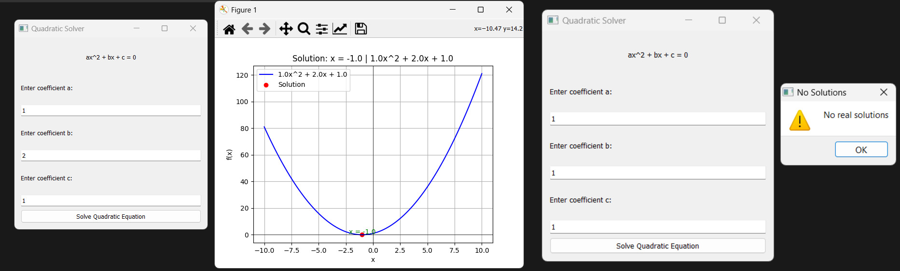

# Quadratic Solver App
    This Python code provides a graphical user interface (GUI) for solving quadratic equations of the form ax^2 + bx + c = 0. It utilizes the PyQt5 library for GUI components and Matplotlib for plotting the quadratic function.

## How to Use

Just Run `main.exe` I already packaged using Pyinstaller.

## Features

    - Input fields for coefficients a, b, and c.
    - Clicking the "Solve Quadratic Equation" button calculates 
      and displays the solutions.
    - The solutions are plotted along with the quadratic function 
      graph.
    - Handles cases with zero, one, or two real solutions.

## Demo

## License

    This code is licensed under the MIT License. Feel free to modify and use it for personal or commercial projects.